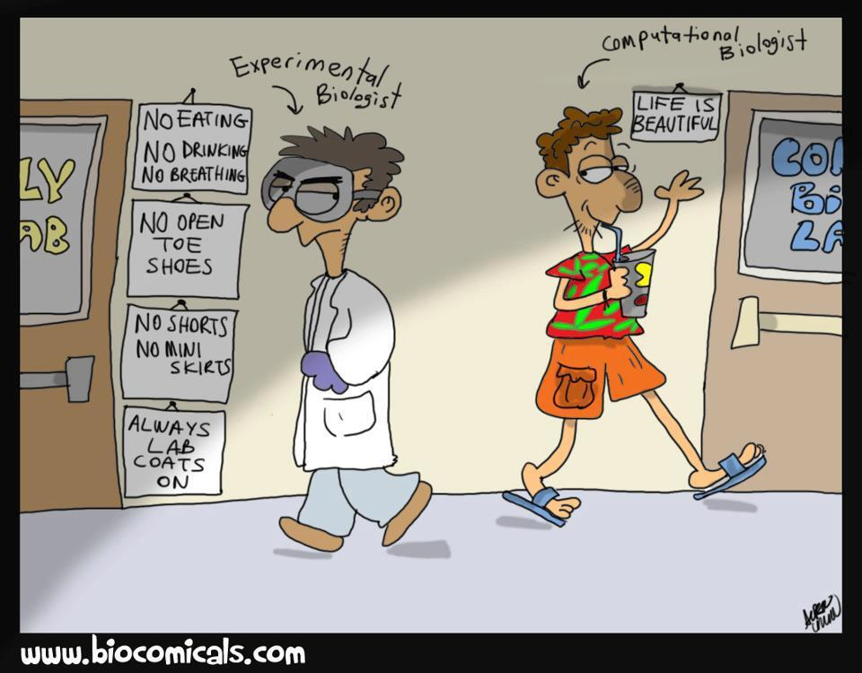

<!-- 
Title : Bioinformatics in 10 minutes
Date : 10/15/2014
Event : APIHour #11
Author : Julien Maupetit
-->

# (bio)
## informatics
### in 10 minutes

Julien Maupetit

----
<!-- ---------- Section ---------- -->
## Disclaimer

> My abstract was a lie.

----
<!-- ---------- Section ---------- -->

## 1 What is
## bioinformatics?

---
### Quick and dirty definition

> Bioinformatics is the application of **computer technology** 
> to the management of **biological information**. 
> <cite>[bioplanet.com](http://www.bioplanet.com/what-is-bioinformatics/)</cite>

---
### World-of-sequences definition

> The **mathematical**, **statistical** and **computing** methods that aim to
> **solve biological problems** using DNA and amino acid sequences and related 
> information.
> <cite>Fredj Tekaia (Pasteur Institute)</cite>

---
### Complete definition

> Bioinformatics is an **interdisciplinary** field that **develops methods and 
> software tools** for understanding biological data [...] combines computer 
> science, statistics, mathematics and engineering to **study and process 
> biological data**.
> <cite>[wikipedia](http://en.wikipedia.org/wiki/Bioinformatics)</cite>

---
### Main research fields

* Genomics (sequences)
* Structural bioinformatics (structures)

----
<!-- ---------- Section ---------- -->

## 2 What is a DNA sequence?

----
<!-- ---------- Section ---------- -->

## 3 What is a protein?

----
<!-- ---------- Section ---------- -->

## 4 Can we assemble a whole genome from small DNA sequences?

----
<!-- ---------- Section ---------- -->

## 5 Can we predict protein structure from sequence?

----
<!-- ---------- Section ---------- -->

## 6 Can we predict protein function from sequence?

----
<!-- ---------- Section ---------- -->

## 7 Can we predict protein stability after a sequence mutation?

----
<!-- ---------- Section ---------- -->

## 8 Can we predict protein-protein interactions from structures?

----
<!-- ---------- Section ---------- -->

## 9 Can we design small molecules *in silico* to inhibit protein activity?

----
<!-- ---------- Section ---------- -->

## 10 Does Jon Snow die in the next Game Of Thrones season?

----
<!-- ---------- Section ---------- -->

Bioinformatics is the cool part of biology.

