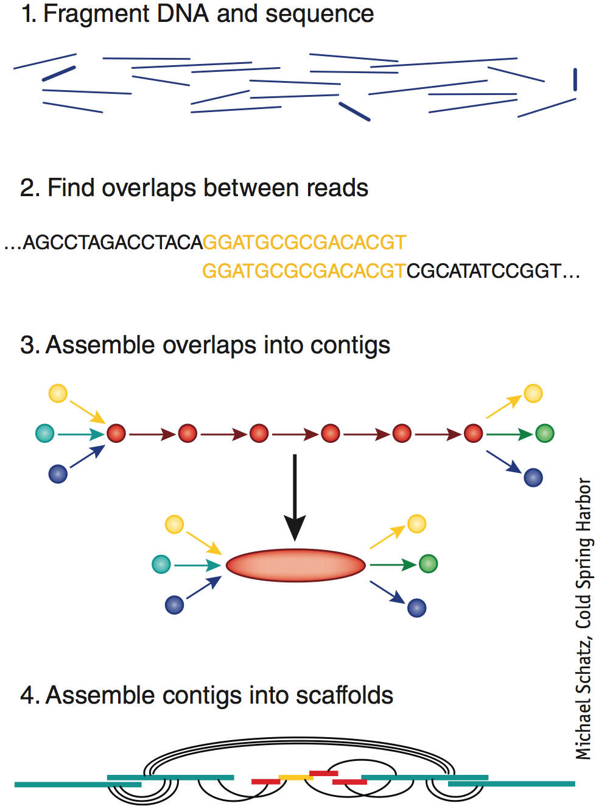

<!-- 
Title : Bioinformatics in 10 minutes
Date : 10/15/2014
Event : APIHour #11
Author : Julien Maupetit
-->

    <h1>(bio)</h1>
    <h2>informatics</h2>
    <h3>in 10 minutes</h3>

    

        Julien Maupetit
    

----
<!-- ---------- Section ---------- -->
## Disclaimer

> My abstract was a lie.

----
<!-- ---------- Section ---------- -->

## 1 What is bioinformatics?

---
### Quick and dirty definition

> Bioinformatics is the application of **computer technology** 
> to the management of **biological information**. 
> <cite>[bioplanet.com](http://www.bioplanet.com/what-is-bioinformatics/)</cite>

---
### World-of-sequences definition

> The **mathematical**, **statistical** and **computing** methods that aim to
> **solve biological problems** using DNA and amino acid sequences and related 
> information.
> <cite>Fredj Tekaia (Pasteur Institute)</cite>

---
### Complete definition

> Bioinformatics is an **interdisciplinary** field that **develops methods and 
> software tools** for understanding biological data [...] combines computer 
> science, statistics, mathematics and engineering to **study and process 
> biological data**.
> <cite>[wikipedia](http://en.wikipedia.org/wiki/Bioinformatics)</cite>

---
### Main research fields

* Genomics (sequences)
* Structural bioinformatics (structures)

----
<!-- ---------- Section ---------- -->

## 2 What is a DNA sequence?

---

### Nucleotides ...

---

### ... can assemble into a polymer called DNA ...

---

### ... with a 3D structure ...

---

### ... that could be cast to string!

    >gi|176120924|ref|NC_001417.2| Enterobacterio phage MS2, complete genome
    GGGTGGGACCCCTTTCGGGGTCCTGCTCAACTTCCTGTCGAGCTAATGCCATTTTTAATGTCTTTAGCGA
    GACGCTACCATGGCTATCGCTGTAGGTAGCCGGAATTCCATTCCTAGGAGGTTTGACCTGTGCGAGC...

----
<!-- ---------- Section ---------- -->

## 3 What is a protein?

---

### RNA transcription

---

### Protein synthesis

---

### Protein 3D structure

Mechanosensitive channel in a lipid bilayer.

----
<!-- ---------- Section ---------- -->

## 4 Can we assemble a whole genome from small DNA sequences?

---

### Genome sequencing

* (Next Generation) sequencing technologies provide 'reads' of short sequences of DNA
* Reads are generated from random locations across the entire genome
* *De novo* assembling techniques have been developed to tackle this problem

---

### Genome assembly

---

----
<!-- ---------- Section ---------- -->

## 5 Can we predict protein structure from sequence?

---

### Protein structure prediction

<iframe width="640" height="480" src="//www.youtube-nocookie.com/embed/sD6vyfTtE4U?rel=0&amp;showinfo=0" frameborder="0" allowfullscreen></iframe>

<small>
    Six Microseconds of Protein Folding  
    Source: [https://www.youtube.com/watch?v=sD6vyfTtE4U](https://www.youtube.com/watch?v=sD6vyfTtE4U)
</small>

----
<!-- ---------- Section ---------- -->

## 6 Can we predict protein function from sequence?

---

### The protein structure-function paradigm

Heavily debated, but:

> Function requires structure.

---

### Protein function prediction

* Homology-based methods
* Sequence motif based methods
* Structure based methods

----
<!-- ---------- Section ---------- -->

## 7 Can we predict protein stability after a sequence mutation?

---

### Mutation impact on protein stability

* A single change in a protein sequence may have drastic consequences... or not
* May explain the cause of a particular disease
* It's a matter of &Delta;&Delta;G prediction

----
<!-- ---------- Section ---------- -->

## 8 Can we predict protein-protein interactions from structures?

---

<iframe width="640" height="480" src="//www.youtube-nocookie.com/embed/Ms_ehUVvKKk?rel=0&amp;showinfo=0" frameborder="0" allowfullscreen></iframe>

<small>
    Source: [https://www.youtube.com/watch?v=Ms_ehUVvKKk](https://www.youtube.com/watch?v=Ms_ehUVvKKk)
</small>

----
<!-- ---------- Section ---------- -->

## 9 Can we design small molecules *in silico* to inhibit protein activity?

---

### Computational Drug Design

<iframe width="640" height="480" src="//www.youtube-nocookie.com/embed/TTtrk0Ue-Cg?rel=0&amp;showinfo=0" frameborder="0" allowfullscreen></iframe>

<small>
    Source: [https://www.youtube.com/watch?v=TTtrk0Ue-Cg](https://www.youtube.com/watch?v=TTtrk0Ue-Cg)
</small>

----
<!-- ---------- Section ---------- -->

## 10 Does Jon Snow die in the next Game Of Thrones season?

---

### Someone knows.

Richard Vale, [*Bayesian Prediction For The Winds Of Winter*](http://arxiv.org/pdf/1409.5830v1.pdf), **arXiv**, sept. 2014 

----
<!-- ---------- Section ---------- -->

## Conclusion

> Bioinformatics is now part of biology...

---

... but the cool part of biology.

----
<!-- ---------- Section ---------- -->

### Credits

* [Nucleotides](http://commons.wikimedia.org/wiki/File:Nucleotides_1.svg)
* [DNA chemical structure](http://commons.wikimedia.org/wiki/File:DNA_chemical_structure.svg)
* [DNA 3D structure](http://upload.wikimedia.org/wikipedia/commons/1/13/A-B-Z-DNA_Side_View_Transparent.png)
* [RNA transcription](http://upload.wikimedia.org/wikipedia/commons/9/9b/MRNA.svg)
* [Protein synthesis](http://upload.wikimedia.org/wikipedia/commons/4/44/Protein_synthesis.svg)
* [Genome Haystack](http://www.genomicglossaries.com/images/shenemangenome.gif)
